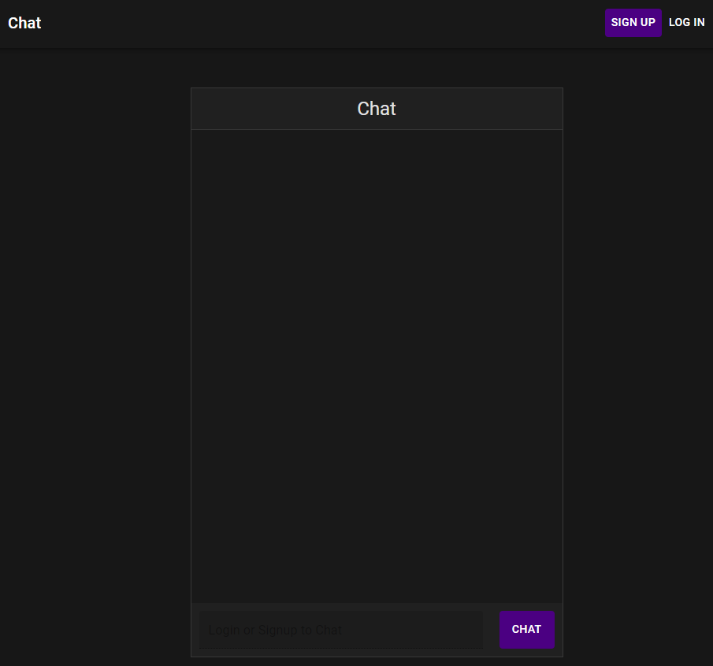
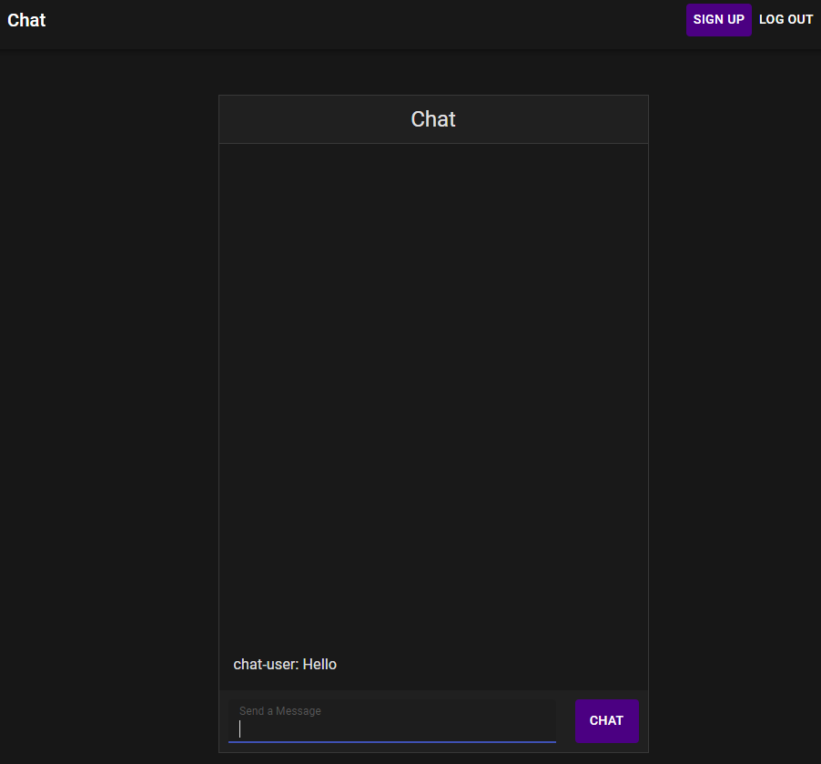

# React Chat Application

A real-time chat application allowing users to broadcast messages to an entire chat room.

Front-end was built using functional <strong>React</strong> and styling was completed using Material-UI.

Back-end chat functionality built using Express and socket.io.

User's can sign in with their social media accounts thanks to Auth0.

 ## Before signup.

 
## After signup.

